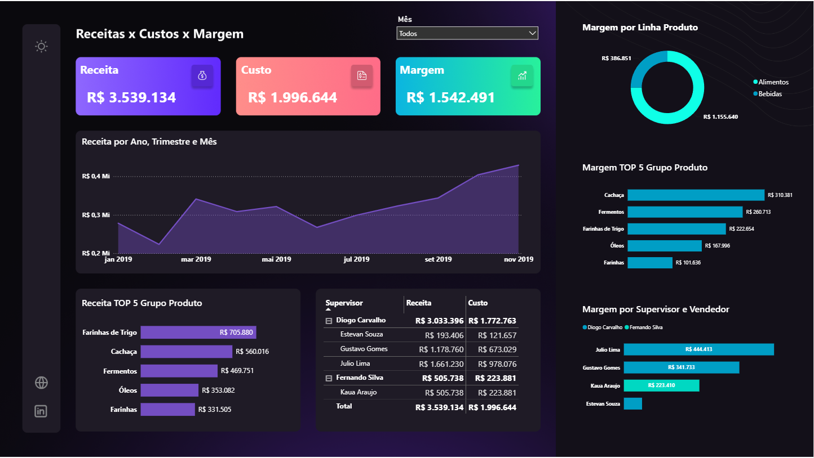

# 📊 Revenue, Cost & Margin Dashboard

---

# 📖 Sobre

Dashboard executivo voltado para análise da rentabilidade da empresa, permitindo acompanhar receitas, custos, margens e desempenho dos produtos e supervisores.

---

# 🎯 Objetivos

- Monitorar lucratividade
- Comparar receitas e custos
- Avaliar margem dos produtos
- Analisar supervisores
- Identificar produtos mais rentáveis

---

# 📊 Indicadores

- Receita
- Custo
- Margem
- Receita Mensal
- Receita por Produto
- Margem por Produto
- Margem por Supervisor
- Receita por Supervisor

---

# 🛠 Tecnologias

- Power BI
- Excel
- Power Query
- DAX

---

# 🚀 Competências

- Business Intelligence
- Financial Analytics
- Data Visualization
- DAX
- Power BI
